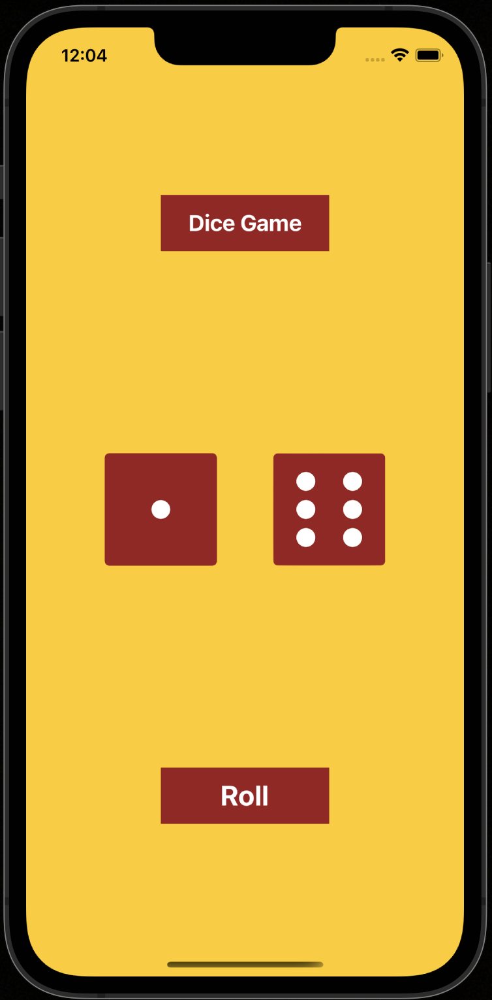
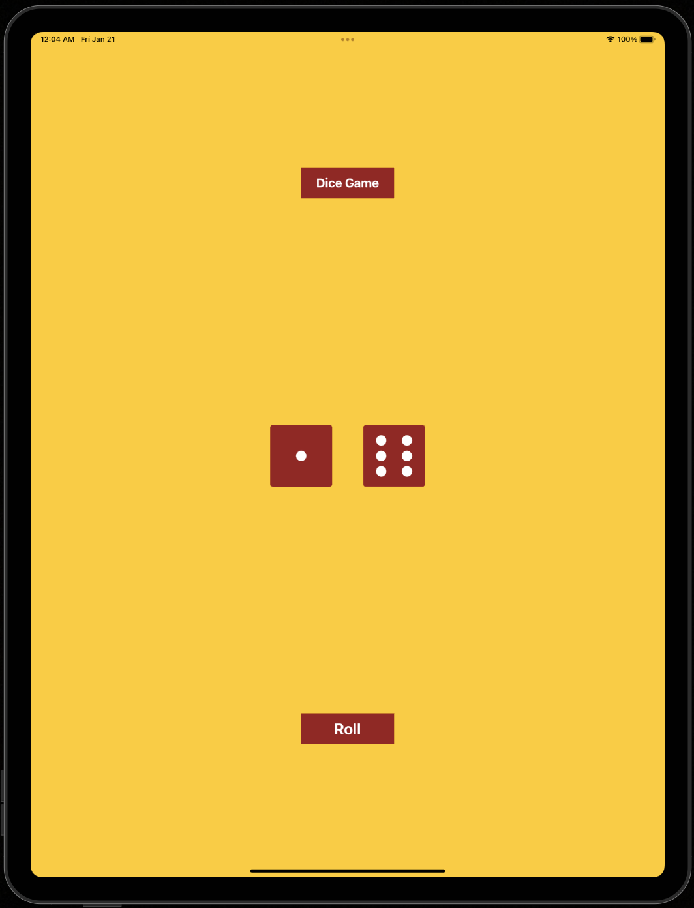
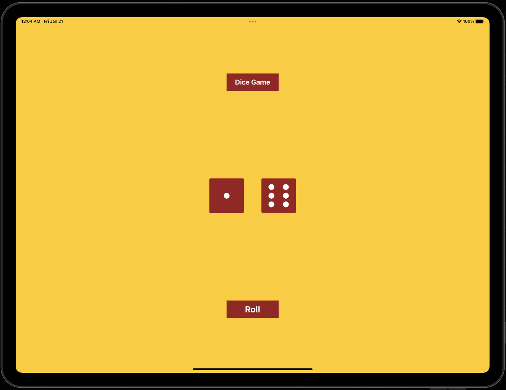

#  Dice App

Simple app to roll the dice on button presses 

## Build On
- XCode 13.2
- Swift 5.5

## What we learn here
- How to links between the Interface Builder files and code using IBActions and IBOutlets
- Understand and use Swift constants and variables.
- Understand and use collection types such as Swift arrays.
-Learn about randomisation and how to generate random numbers in Swift.

## Screenshots

### iPhone Portrait Mode

### iPhone Lanscape Mode

### iPad Portrait Mode

### iPad Portrait Mode

## Contact
Name: Manish Ahre

Portfolio: [www.manishahire.com](https://www.manishahire.com/) 

Blog: [www.mobodevstuff.com](https://www.mobodevstuff.com/) 
